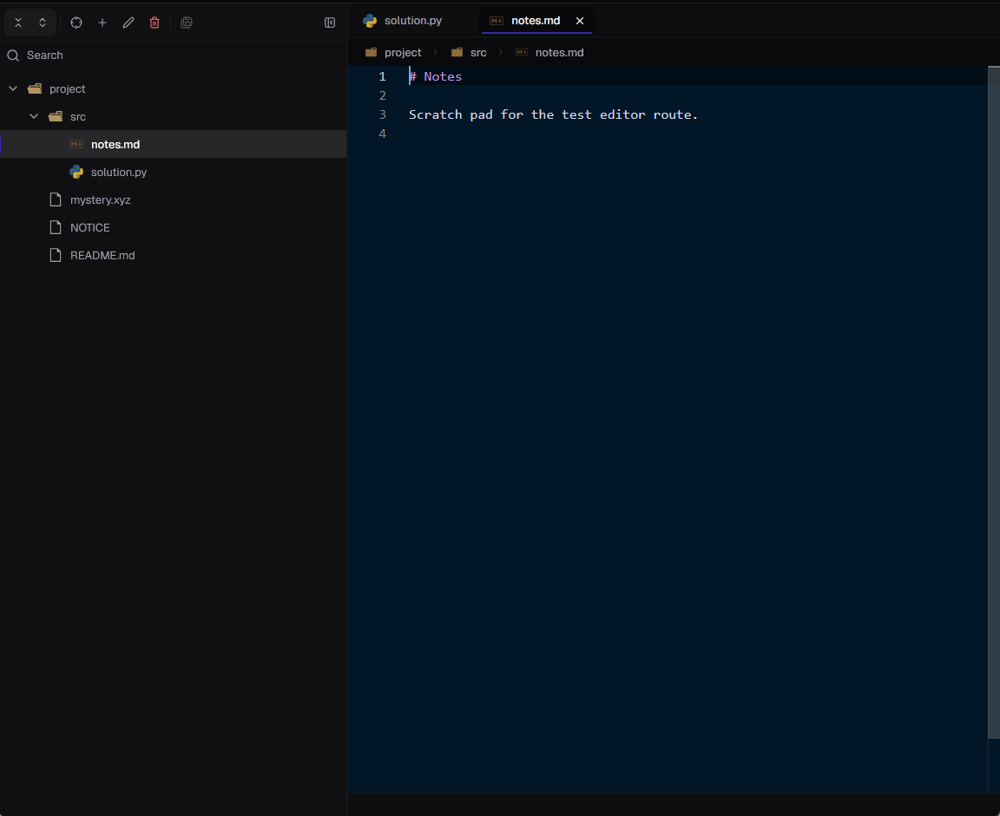

<div align="center">

# @anacode/code-editor

**A self-contained, multi-file code editor for the web — built on [Monaco](https://github.com/microsoft/monaco-editor), packaged as a drop-in Svelte 5 component.**

[**▶ Live demo**](https://anassbousseaden.github.io/anacode-code-editor/) &nbsp;·&nbsp;
[Editor](https://anassbousseaden.github.io/anacode-code-editor/) &nbsp;·&nbsp;
[Import / Export](https://anassbousseaden.github.io/anacode-code-editor/import-export) &nbsp;·&nbsp;
[Multi-editor](https://anassbousseaden.github.io/anacode-code-editor/multi-editor)


<picture>
  <source media="(prefers-color-scheme: dark)" srcset="static/editor-screenshot/dark-editor.png">
  <source media="(prefers-color-scheme: light)" srcset="static/editor-screenshot/light-editor.png">
  
</picture>

_File tree, tabs, and Monaco in a single `<EditorSession>` component (shown in both bundled themes)._

</div>

---

## What it is

`@anacode/code-editor` provides the pieces around Monaco that a multi-file editing experience needs: a file tree, tabs, an in-memory file system, per-file save/dirty state, and detection of when a file has changed underneath the editor. It's packaged as a single Svelte 5 component you can drop in, or as individual services you can compose.

- **Drop-in or composable** — render one `<EditorSession>`, or wire the underlying services yourself through subpath exports.
- **Works with real projects** — the demo loads full open-source repositories (FastAPI, Caddy, Cobra, Resilience4j) from a zip.
- **Content-hash conflict detection** — writes are compare-and-swap against a content hash, so a file changed elsewhere surfaces a conflict prompt rather than being overwritten.
- **Layered and typed** — a documented [architecture](docs/Architecture.md), interface-driven services, and `Result<T, E>` return types throughout.

---

## Demos

Three routes in the [deployed demo](https://anassbousseaden.github.io/anacode-code-editor/), each showing a different part of the package:

- **[Editor](https://anassbousseaden.github.io/anacode-code-editor/)** — a multi-file editor in one component: file tree (create / rename / move / delete, drag-and-drop, search, context menu, VS Code icons), tabs with a breadcrumb, and per-file dirty/save state.
- **[Import / Export](https://anassbousseaden.github.io/anacode-code-editor/import-export)** — import a project as a `.zip` (or pick a bundled sample like FastAPI ~19 MB), edit in place, and download the result.
- **[Multi-editor](https://anassbousseaden.github.io/anacode-code-editor/multi-editor)** — two independent `EditorSession` instances bound to the same in-memory file system; a structural change in one is reflected in the other.

---

## Features

**Editing**
- Monaco-powered editor with multi-file tabs, breadcrumb, and per-file view-state (cursor, scroll, folds) preserved across switches
- Configurable font size, tab size, word wrap, line numbers, minimap, and theme (bundled Night Owl & Tomorrow)
- Light/dark aware

**File system**
- In-memory, **command → plan → event** file system: every mutation is validated into a plan, then executed to atomic events (event-sourced, Immer-backed)
- Create / rename / move / delete with a graph index that rejects illegal moves (cycle detection)
- File-tree search, drag-and-drop, and a typed command registry

**Saving & conflicts**
- Per-document draft state: dirty tracking, save / save-all / revert / force-overwrite
- **Content-hash conflict detection** (compare-and-swap) — edits against a stale file raise a conflict you resolve via reload or overwrite
- Handles files that disappear underneath the editor (invalid-document state) and reloads buffers when content changes on disk

**Persistence**
- Zip import / export of the whole workspace, with pluggable strategies

**Engineering**
- Layered, documented architecture (Core → Primitives → Orchestration → Composition)
- Interface-driven services; `Result<T, E>` error handling instead of exceptions
- Subpath exports and shipped `.d.ts` types

---

## Quick start

> **Status:** pre-release (`v0.0.1`). Not yet published to npm — for now, clone this repo or install from GitHub. The snippet below is the condensed version of the fully runnable demo in [`src/routes/+page.svelte`](src/routes/+page.svelte).

```sh
# peer dependencies
npm install svelte bits-ui @lucide/svelte mode-watcher svelte-sonner tailwindcss tw-animate-css
```

```svelte
<script lang="ts">
  import { onMount, onDestroy } from 'svelte';
  import {
    EditorSession,
    EditorSessionFactory,
    NodeType,
    ROOT_NODE_ID,
    ROOT_PERMISSIONS,
    EMPTY_CONTENT_HASH,
    type FileSystemMapReadonly,
    type FileSystemPath,
    type NodeID,
    type IEditorSession
  } from '@anacode/code-editor';
  import { FileSystemZipImporter } from '@anacode/code-editor/persistence';
  import { StaticDefaultEditorConfigurationService } from '@anacode/code-editor/config';
  import '@anacode/code-editor/styles.css';

  // A minimal two-file workspace.
  const initialState: FileSystemMapReadonly = {
    [ROOT_NODE_ID]: {
      id: ROOT_NODE_ID, type: NodeType.FOLDER, name: 'project',
      path: '/project' as FileSystemPath, parentID: null,
      permissions: ROOT_PERMISSIONS, children: [1 as NodeID], userSpace: null
    },
    [1 as NodeID]: {
      id: 1 as NodeID, type: NodeType.FILE, name: 'hello.ts',
      path: '/project/hello.ts' as FileSystemPath, parentID: ROOT_NODE_ID,
      content: 'export const hello = () => "world";\n',
      contentHash: EMPTY_CONTENT_HASH,
      permissions: { read: true, write: true, rename: true, delete: true },
      userSpace: null
    }
  };

  let session: IEditorSession | null = $state(null);
  const factory = new EditorSessionFactory(new FileSystemZipImporter());
  const config = new StaticDefaultEditorConfigurationService();

  onMount(async () => {
    const result = await factory.createFromFileSystemMap(initialState, config);
    if (result.ok) session = result.value;
  });

  onDestroy(() => session?.dispose());
</script>

{#if session}
  <EditorSession {session} />
{/if}
```

The factory also offers `createFromFileSystem(...)` (bring your own `IFileSystemService`) and `createFromZip(...)`. See [`src/routes/`](src/routes/) for all three patterns running end-to-end.

---

## Two ways to use it

| | Drop-in | Compose |
|---|---|---|
| **You write** | `<EditorSession {session} />` | wire the individual services yourself |
| **You get** | the full editor experience | full control over file system, save, conflict, tree, tabs |
| **Import from** | `@anacode/code-editor` | `@anacode/code-editor/file-system`, `/session`, `/persistence`, `/state`, `/config`, `/shared`, … |

The root entry exposes the drop-in surface; concern-scoped entry points expose the underlying services for composing the stack yourself. Internals not promoted to a barrel remain reachable via deep subpath imports.

---

## Architecture

Dependencies flow downward only. The core is framework-agnostic — no Svelte and no Monaco below the UI layers.

```
Layer 3  Composition      EditorSession · EditorWorkspace · session factory
   ▲
Layer 2  Orchestration    presentation orchestrator · attachment port · projections
   ▲
Layer 1  Primitives       file-system · documents · save · conflict · tree · tabs · prompts
   ▲
Layer 0  Core             command→plan→event engine · graph index · hashing · Result types
```

The full design — package boundary, dependency rules, the command/plan/event and Result patterns, naming conventions — is documented in **[docs/Architecture.md](docs/Architecture.md)**.

---

## Tech stack

Svelte 5 (runes) · TypeScript (strict) · Monaco · Tailwind CSS v4 · [bits-ui](https://bits-ui.com) (shadcn-svelte primitives) · [graphology](https://graphology.github.io) · Immer · JSZip · Vite · Vitest

---

## License

[MIT](LICENSE)
